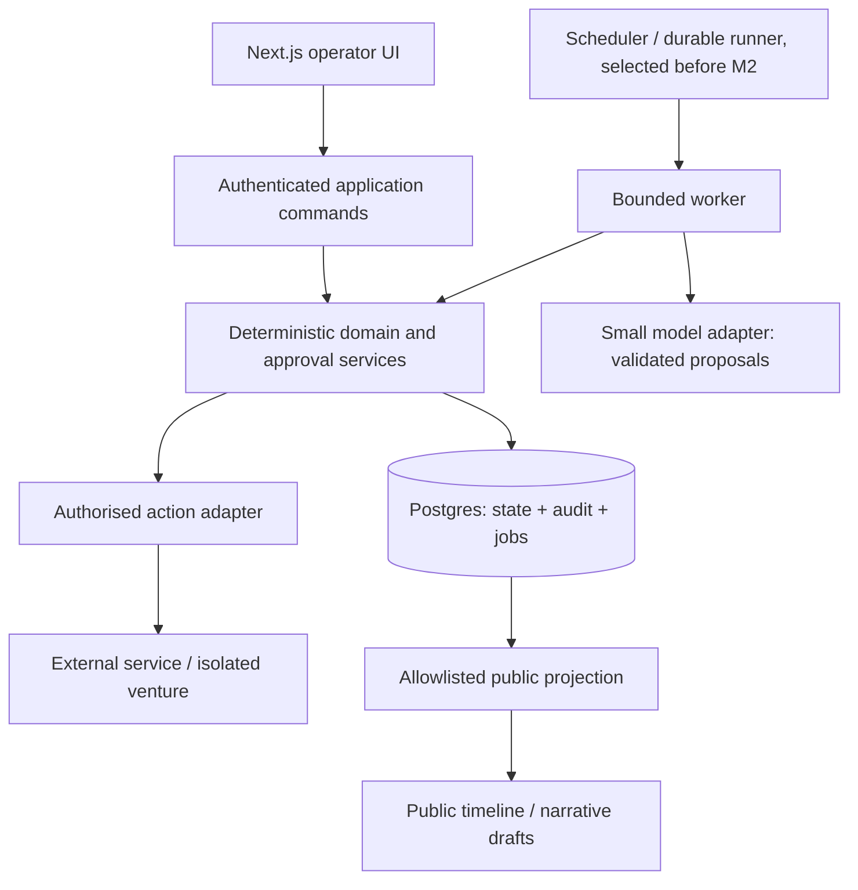

# Architecture review — M0 / Issue #1

Reviewed 2026-09-21 against README, AGENTS, PRD, ARCHITECTURE, ROADMAP and [Issue #1](https://github.com/mralexcheeseman/impossible/issues/1). This review precedes application implementation. Recommendations below distinguish future contracts from M0 deliverables.

## What is strong

**KEEP:** A modular application with deterministic orchestration and bounded, stateless AI workers is the simplest credible foundation. Postgres owns durable business state. Agents propose; application services validate and authorise. Preserve dissent and evidence provenance. Keep the public story a separate, allowlisted projection, never a raw ledger feed. Keep venture products separate from the core when Builder gains execution privileges.

**KEEP:** Next.js + Vercel + Supabase fits a single-operator control plane. A different frontend or self-hosted database would add operational work without improving Experiment 001. Deployable M0 is not an operationally ready autonomous system.

## What I would change now

**IMPROVE NOW — atomic audit:** “Same logical operation where practical” is too weak. Commit domain state, ordered audit event and any dispatch intent in one database transaction. Use current-state tables plus an append-only ledger, not full event sourcing. A unique command ID prevents duplicate mutations; serialisation per experiment allocates event sequence safely. Database privileges prohibit application UPDATE/DELETE of audit records. Administrative access remains a separate trust boundary; append-only does not mean cryptographically tamper-proof.

**IMPROVE NOW — resumable execution:** Seven days is an experiment deadline, not a request lifetime. Before M2, persist job input references, status, attempt, next run time, lease expiry, fencing/version token, error class and output references. Recover expired leases; bound retries and tool/model costs; reconcile jobs whose completion is uncertain. Enqueue transactionally (an outbox if dispatch is external). A stale worker cannot commit results after pause, termination or a newer lease. Do not claim exactly-once external execution: use stable provider idempotency keys, record receipts, and reconcile unknown outcomes before retrying.

**IMPROVE NOW — authority at execution:** Approval binds the actor, immutable action payload/version, target, policy version and expiry. Editing a proposal invalidates its approval. The adapter rechecks authorisation, experiment state, deadline and budget immediately before execution. Approval, dispatch and outcome are distinct events. Model-supplied risk labels are advisory. Unknown actions default to blocked. Constitution violations such as deceptive identity or spam are prohibited even with approval; they must not appear as approvable RED actions.

**IMPROVE NOW — control semantics:** Persist lifecycle status separately from stage. Pause retains stage and original deadline; resuming does not grant another seven days. A paused experiment still occupies the single active slot. Kill is terminal. Deadline expiry prevents new venture work but permits controlled reconciliation and final analysis. Already submitted external effects may complete after pause/kill: surface and reconcile them, never promise rollback. Move these requirements into M1/M2 instead of first implementing them at M9.

**IMPROVE NOW — durable learning inputs:** Preserve versioned hypotheses, predictions and confidence with their target outcome/horizon; evidence IDs and contradictory evidence; Sceptic objections linked to subsequent outcomes; decision rationale, actor, timestamp and policy/prompt/schema/model versions. Store missing measurements as unknown, not zero. Record source, denominator, observation window and deduplication identifier for behavioural metrics. Link interventions to decisions/runs, distinguish approval time from repair/override work, and mark measured versus estimated minutes. These are incremental data contracts, not a learning platform.

**IMPROVE NOW — safe developer boundaries:** Explicitly separate M0 from the combined M0/M1 instructions. Document privileged services, tests required before agents run, and ADRs. Add CI, repeatable installation and a minimal shell with no simulated activity. Future Builder runs in an isolated workspace with scoped credentials, resource limits, dependency checks and reviewed deployment; untrusted code and retrieved content never receive core secrets or authority.

## What I would deliberately defer

**DEFER:** Agent frameworks, a message broker, microservices, full event sourcing, vector infrastructure, generic model/tool registries, multi-tenancy, autonomous social publishing and autonomous payments. No existing requirement justifies their implementation in M0. Add a narrow provider interface with structured generation in M2; do not invent tool or embedding abstractions now.

**DEFER:** Automatic cross-experiment learning, causal attribution and a model leaderboard. Capture provenance first. Correlation between evidence and demand is not proof of predictive value, and model comparisons need comparable task difficulty and costs.

**DEFER:** Complete schemas for all eleven domain entities. Build the kernel in M1 and add evidence, predictions, metrics and narrative records with the milestones that use them. Empty folders and speculative interfaces would obscure the actual boundaries.

## Missing considerations

The existing documents name idempotency and retries but do not define crash recovery, duplicate delivery, late worker writes, ambiguous external success, approval expiry or the pause race. They do not specify audit atomicity or clarify that RLS can be bypassed by privileged keys. They also omit privacy/retention boundaries for evidence and public projections, spend limits for model calls (distinct from the £0 acquisition budget), and attribution for human time.

**IMPROVE NOW:** Keep sensitive evidence bodies out of immutable event payloads; reference access-controlled records with a retention/redaction policy. Record authorised deletion/redaction events without preserving deleted personal data in the ledger. M1 must define operator identity authorisation as well as authentication and deny-by-default database access; a valid login alone is insufficient.

Product ambiguity remains: current V1 Builder produces specifications while the requested eventual loop includes building and observing a real product. Preserve that scope. Experiment 001 needs an explicitly approved human-assisted build/distribution path and real metric ingestion; record that human work. Do not silently call a build specification or synthetic metric a completed market experiment.

## Recommended architecture

These are module boundaries, not separate services. In M0 only the static UI, configuration, Supabase factories and checks exist. M1 supplies the transactional kernel and controls. M2 introduces recoverable execution. Later milestones add workers and external adapters through the same authority boundary.

## Decision log

| Decision / classification | Reason | Alternative considered; why rejected/deferred | Reversibility |
| --- | --- | --- | --- |
| KEEP modular Next.js/Vercel/Supabase | Matches operator UI, auth and relational audit needs | Separate API and self-hosting add operational burden now | Domain modules and SQL keep a later host move feasible |
| KEEP stateless workers; deterministic authority | Models are useful for synthesis and challenge, not granting permission | Agent-to-agent authority makes replay and policy opaque | Worker implementations can change behind typed contracts |
| IMPROVE NOW transactional state + ledger | Prevents audit gaps and conflicting transitions | Full event sourcing imposes replay/migration cost without need | Add projections later; retain existing ledger versions |
| IMPROVE NOW durable job/action contracts | Survives process loss and ambiguous tool outcomes | In-memory tasks and blind retries lose work or duplicate effects | Runner replaceable using persisted business/action IDs |
| EXPERIMENT runner selection before M2 | Provider ergonomics and failure behaviour need evidence | Compare a Postgres lease worker, Vercel Workflow and managed durable runners such as Inngest/Temporal; no M0 dependency | Time-box spike; document result in an ADR |
| IMPROVE NOW payload-bound approvals and prohibition precedence | Prevents changed actions exploiting stale authority | Approving a broad action type is unsafe | Policies versioned; old approvals cannot silently acquire new powers |
| IMPROVE NOW pause/kill/deadline contracts in kernel | Safety cannot be added after autonomous execution | M9-only implementation leaves earlier agents uncontrollable | Lifecycle semantics stable; implementation evolves |
| IMPROVE NOW versioned learning and intervention references | Later calibration and causal reconstruction require original beliefs | Retrospective narrative loses dissent and introduces hindsight | Add fields per milestone; version records instead of rewriting |
| KEEP public projection; IMPROVE NOW retention boundary | Supports grounded Documentarian without exposing private data | Publishing raw events or storing all raw context is unsafe | Projection can be regenerated from permitted records |
| DEFER framework, vectors, provider generalisation | No M0 workload demonstrates need | Framework-led architecture introduces unused coupling | Add only after representative workload tests |
| KEEP future product isolation; DEFER executor | Restricts coding-agent blast radius | Running generated code inside core mixes privileges and dependencies | Build specs portable; per-venture repos introduced with execution |
| EXPERIMENT model mix and Sceptic independence | Separate roles alone do not prove independent error detection | Mandating multiple vendors before evaluation adds complexity | Benchmark seeded false claims, dissent retention, costs and schema validity in M2–M4 |
| IMPROVE NOW explicit human-assisted Experiment 001 path | Build specs cannot supply real behavioural evidence alone | Silently expanding Builder into deployment violates scope | Operator chooses a narrow test before readiness |

### Runner experiment acceptance

Before background agents: crash after claim, after model response, after external success and before local receipt; redeliver a job; expire its lease; pause during execution; resume after deployment; pass the deadline while waiting for approval. Verify no duplicate domain mutation, no blind retry of uncertain side effects, no stale worker commit, bounded spend, eventual recovery and a reconstructable trace. Evaluate multi-day waits with persisted clocks and a staging soak before seven-day operation. Select the smallest option that passes; database polling alone is not a scheduler unless a reliable worker actually runs it.

## Contemporary source checks

Checked 2026-09-21. Hosted limits and APIs change; verify against the deployment plan when implementing execution.

- [Next.js installation](https://nextjs.org/docs/app/getting-started/installation): App Router/TypeScript baseline; explicit lint and typecheck commands remain CI gates.
- [Vercel function limits](https://vercel.com/docs/functions/limitations): bounded execution means a seven-day loop needs durable scheduling and resumable steps.
- [Supabase SSR clients](https://supabase.com/docs/guides/auth/server-side/creating-a-client): separate browser/server factories; session refresh and verified authentication belong in M1 before private routes.
- [Supabase API keys](https://supabase.com/docs/guides/getting-started/api-keys) and [RLS](https://supabase.com/docs/guides/database/postgres/row-level-security): use publishable keys with user-scoped clients; privileged credentials bypass RLS and must not reach the browser or models.
